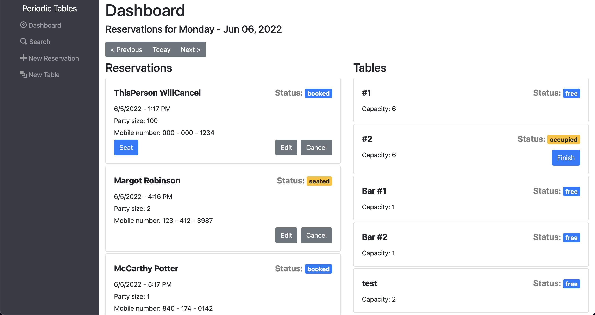
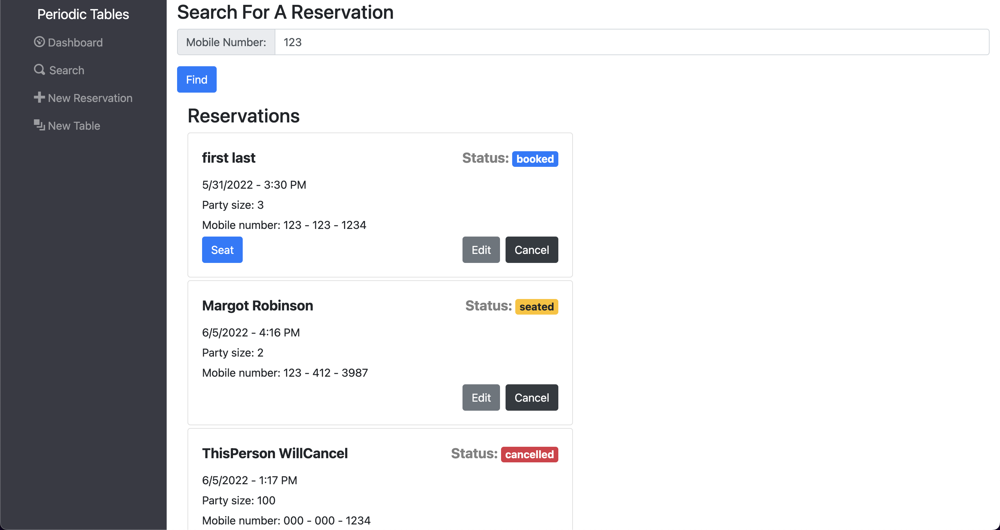
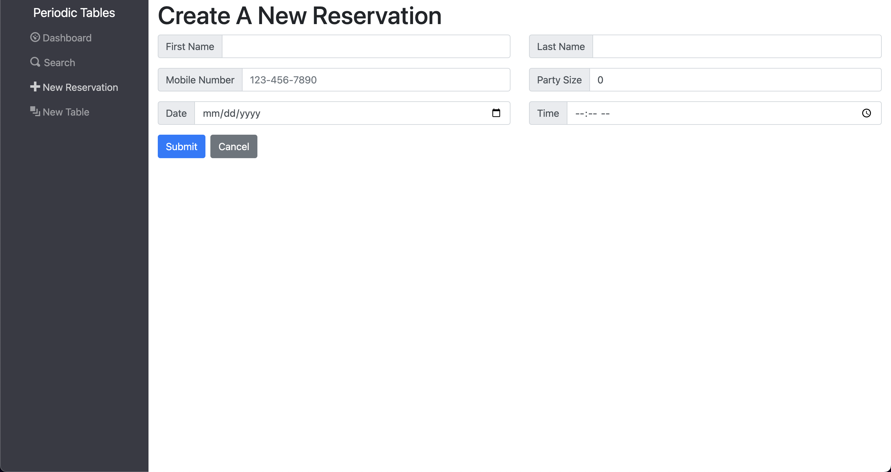
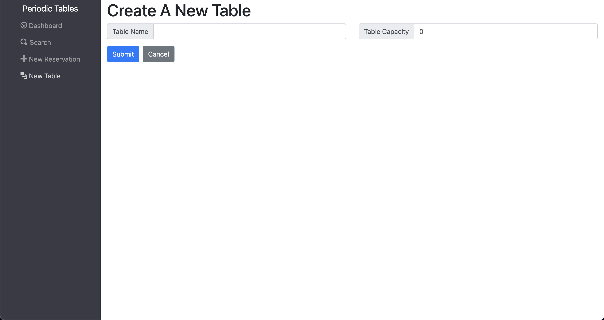

<div id="top"></div>
<br />
<div align="center">

<h3 align="center">Periodic Tables</h3>

  <p align="center">
    Periodic Tables is a reservation systems that will help restaurants streamline their operations by incorporating a customer, reservation, and table management web application. It allows the creation of new reservations and new tables, as well as updating them to reflect the most up-to-date statuses.
    <br />
    <a href="https://restaurant-reservation-system-frontend.vercel.app/dashboard"><strong>View the live demo »</strong></a>
    <br />
    <br />

  </p>
</div>


<!-- TABLE OF CONTENTS -->
<details>
  <summary>Table of Contents</summary>
  <ol>
    <li>
      <a href="#about-the-project">About The Project</a>
      <ul>
        <li><a href="#built-with">Built With</a></li>
      </ul>
    </li>
    <li>
      <a href="#getting-started">Getting Started</a>
      <ul>
        <li><a href="#installation">Installation</a></li>
      </ul>
    </li>
    <li><a href="#pages">Pages</a></li>
    <li><a href="#api-documentation">API Documentation</a></li>
    <li><a href="#user-stories">User Stories</a></li>
    <li><a href="#contact">Contact</a></li>
  </ol>
</details>


<!-- ABOUT THE PROJECT -->
## About The Project




<p align="right">(<a href="#top">back to top</a>)</p>


### Built With

* [React.js](https://reactjs.org/)
* [Bootstrap](https://getbootstrap.com)
* [Node.js](https://nodejs.org/en/)
* [Knex.js](https://knexjs.org/)
* [Express](https://expressjs.com/)
* [PostgreSQL](https://www.postgresql.org/)
* [Swagger](https://www.npmjs.com/package/express-jsdoc-swagger)
* [Swagger UI](https://www.npmjs.com/package/swagger-ui-express)

<p align="right">(<a href="#top">back to top</a>)</p>


<!-- GETTING STARTED -->
## Getting Started

To get a local copy up and running follow these steps.

### Installation
1. Clone the repo
   ```sh
   git clone https://github.com/PhamJimmy/restaurant-reservation-system.git
   ```
2. Install NPM packages
   ```sh
   npm install
   ```
4. Copy the `.env.sample` file and make a `.env` file
5. Fill in environment variables
6. Run the app
   ```sh
   npm start
   ```

<p align="right">(<a href="#top">back to top</a>)</p>


<!-- PAGE EXAMPLES -->
## Pages

### Dashboard
The main page showing the day's reservations and all the table statuses.


### Search
Entering in a phone number will search the database for any matches regardless of reservation status.


### New Reservation
The form to create a new reservation which will be assigned a new reservation_id.


### New Table
The form to create a new table which will be assigned a new table_id.


<p align="right">(<a href="#top">back to top</a>)</p>


<!-- API DOCUMENTATION -->
## API Documentation

See the [API Documentation](https://jpr-restaurant-res-backend.herokuapp.com/api-docs) for a breakdown of the endpoints.


<p align="right">(<a href="#top">back to top</a>)</p>


<!-- USER STORIES -->
## User Stories

See the [user stories](https://github.com/PhamJimmy/restaurant-reservation-system/blob/main/USERSTORIES.md) for a full list of the original proposed features.

<p align="right">(<a href="#top">back to top</a>)</p>


<!-- CONTACT -->
## Contact

Jimmy Pham - [LinkedIn](https://www.linkedin.com/in/jimmy-pham-res/) - JimmyPhamRes@gmail.com

Project Link: [https://github.com/PhamJimmy/restaurant-reservation-system](https://github.com/PhamJimmy/restaurant-reservation-system)

<p align="right">(<a href="#top">back to top</a>)</p>
